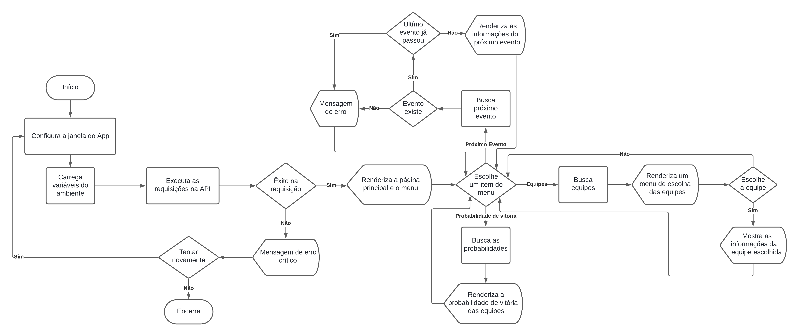

# SPRINT - TECH MAHINDRA (Python)

- [Hub de informações - Python](#hub-de-informações---python)
   - [Sobre o projeto](#sobre-o-projeto)
      - [Funcionalidades do Projeto](#funcionalidades-do-projeto)
      - [Objetivo do Projeto](#objetivo-do-projeto)
  - [Execução do projeto](#execução-do-projeto)
  - [Gerar build do projeto](#gerar-build-do-projeto)
- [Integrantes do grupo](#integrantes-do-grupo)

## Hub de informações - Python

### Sobre o projeto

Você já imaginou ter um hub completo de informações sobre a Fórmula E em português? Esse projeto foi criado exatamente para isso! Nosso objetivo é popularizar a Fórmula E no Brasil, fornecendo um ponto centralizado para todas as informações que você precisa sobre essa emocionante categoria de corrida.

#### Funcionalidades do Projeto

- **Próximos Eventos**: Fique por dentro dos próximos eventos da Fórmula E com detalhes sobre datas, locais e horários.
- **Equipes**: Acesse informações detalhadas sobre as equipes, incluindo probabilidades de vitória, posição, pontos e muito mais.
- **Pilotos**: Conheça os pilotos da Fórmula E, incluindo detalhes sobre suas equipes, nacionalidade, pontos, vitórias e muito mais.

#### Objetivo do Projeto

Popularizar a Fórmula E no Brasil, tornando as informações sobre essa categoria de corrida mais acessíveis para o público em geral. Através deste projeto, esperamos aumentar o interesse e o conhecimento sobre os avanços tecnológicos e a sustentabilidade promovida pela Fórmula E.

---

### Execução do projeto

Você tem duas opções para usar o projeto:

- **Usar uma build existente**: Acesse as versões disponíveis [aqui](https://github.com/Wisers-1ESS/Challenge-Python/releases). **Leia atentamente a descrição da release** para mais detalhes.
  
- **Gerar sua própria build**: Siga os passos abaixo.

**Para executar o projeto, siga as seguintes etapas:**

1. Clone o repositório para o seu ambiente local:

   ```
   git clone https://github.com/Wisers-1ESS/Challenge-Python.git
   ```

2. Navegue até o diretório do projeto:

   ```
   cd Challenge-Python
   ```

3. Instale as dependências necessárias:

   ```
   pip install -r requirements.txt
   ```

4. Crie uma conta no <a href="https://console.sportradar.com/">SportRadar</a> para gerar uma chave privada da API utilizada no projeto.
   - Após entrar, acessa a área de **Applications** e selecione uma existente, ou crie uma nova.
   - Clique em **_Add Trials_** e selecione _Sports API_.
   - Pesquise **Formula E** e adicione na sua Application.
   - Uma chave API foi criada, copie ela em **_API Key_**.
5. Crie um arquivo `.env` na raiz do projeto e adicione as seguintes linhas:

   ```
   API_KEY=SUA_API_KEY_AQUI
   ```

   - Substitua `SUA_API_KEY_AQUI` pela sua chave privada da <a href="https://developer.sportradar.com/racing/reference/formula-e-overview" target="_blank">API SportRadar - Formula E</a>.
   - Salve o arquivo `.env`.

6. Execute o projeto:

   ```
   python main.py
   ```
   ou
   ```
   flet run main.py
   ```

Certifique-se de ter o Python e o pip instalados em seu ambiente antes de executar o projeto.


---

### Gerar build do projeto

**Etapas necessárias:**

1. **Pre-requisitos**: Certifique-se de seguir todas as instruções da seção [Execução do projeto](#execução-do-projeto) antes de prosseguir.

2. **Configuração da build**: Acesse a documentação do [Flet](https://flet.dev/docs/publish), escolha a plataforma desejada, e siga as instruções para configurar o ambiente de build (incluindo Flutter SDK, Android SDK, etc.).

3. **Gerar build**: Execute o seguinte comando, substituindo `{plataforma}` pela opção correspondente (ex: `apk`, `aab`, `ipa`, `web`, `macos`, `windows`, `linux`):

   ```bash
   flet build {plataforma}
   ```

4. **Resultado**: Após a conclusão, a build estará disponível na pasta `build` do projeto.

#### **IMPORTANTE**: O passo a passo detalhado para cada plataforma está na [documentação do Flet](https://flet.dev/docs/publish).

---

### Diagrama de blocos do app



## Integrantes do grupo

- Matheus Queiroz - RM558801
- Matheus Vinícius- RM555177
- Enzo Miletta - RM98677
- Marcela Torro - RM557658
- Lucas Son - RM554724